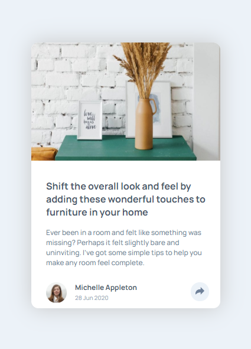

   

# Challenges of Frontendmentor.io solved

 

## #01 - Fylo Data Storage Component (Newbie)

### Web

### Mobile

  

## #02 - Article Preview Component (Newbie)

### Web

### Mobile 

  

## #03 - Single Price Grid Component (Newbie)

### Web

### Mobile 
